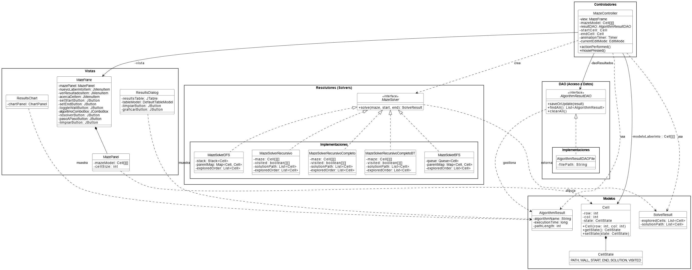
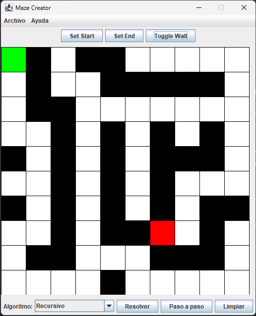
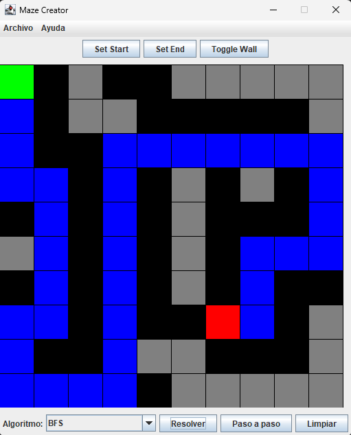
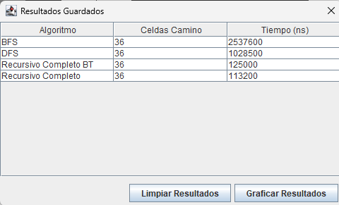
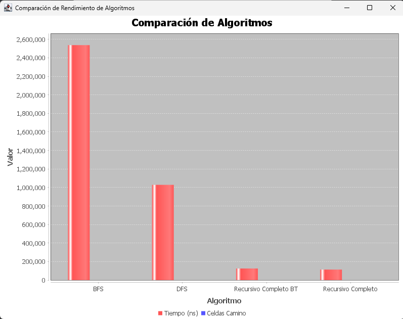

# 🧩 Proyecto Final - Maze Creator


**Asignatura:** Estructura de Datos

**Estudiante 1:** Derlis Sebastian Yupangui Buestan - dyupanguib@est.ups.edu.ec

**Estudiante 2:** Javier Andree Barrezueta Ordoñez - jbarrezuetao@est.ups.edu.ec

**Docente:** Ing. Pablo Torres


## ⚙️ Descripción del Problema
Este proyecto fue desarrollado como parte de la asignatura **Estructura de Datos**.
Su objetivo principal es demostrar la implementación y comparación de algoritmos de búsqueda en una aplicación de escritorio interactiva, aplicando patrones de diseño y una arquitectura robusta.

## 🎯 Objetivo del Proyecto
Implementar un sistema visual e interactivo, denominado **"Maze Creator"**, que permita a los usuarios diseñar y resolver laberintos. La aplicación compara el rendimiento de múltiples algoritmos de búsqueda a través de animaciones, métricas de rendimiento y gráficos comparativos, utilizando una arquitectura desacoplada basada en **MVC**, **DAO** y **Estrategia**.

## 🛠️ Tecnologías Utilizadas
- 💻 **Java (JDK 8+)**

- 🎨 **Swing** para la interfaz gráfica

- 📊 **JFreeChart** para la visualización de gráficos

- 📦 **Apache Maven** para la gestión de dependencias y construcción del proyecto

- 🐙 **Git y GitHub** para el control de versiones

## 🧱 Patrones de Diseño Aplicados
- **MVC (Modelo-Vista-Controlador)**

    Para separar la lógica de los algoritmos (Modelo), la interfaz gráfica (Vista) y la interacción del usuario (Controlador).

- **DAO (Data Access Object)**

    Para abstraer la persistencia de los resultados en un archivo CSV, desacoplando la lógica de negocio del mecanismo de almacenamiento.

- **Estrategia (Strategy)**

    Para encapsular cada algoritmo de resolución en su propia clase (MazeSolver), permitiendo que sean seleccionados e intercambiados dinámicamente sin alterar el controlador.

## 📂 Estructura del Proyecto
El proyecto sigue la estructura estándar de Maven para una organización clara y mantenible:
```
icc-est-ProyectoFinal/
├── src/
│   └── main/
│       └── java/
│           ├── controllers/
│           ├── dao/
│           ├── models/
│           ├── solver/
│           ├── views/
│           └── MazeApp.java
└── pom.xml
```
## ✨ Funcionalidades Principales
- 🎨 **Diseño Interactivo:** Permite crear laberintos de tamaño personalizado y definir muros, punto de inicio y punto de fin con clics del ratón.

- 🧠 **Múltiples Algoritmos:** Incluye 5 estrategias de resolución: Recursivo (2 y 4 direcciones), Recursivo con Backtracking, BFS y DFS.

- 🎬 **Animaciones Visuales:** Muestra en tiempo real la exploración de los algoritmos (celdas grises) y traza la solución final (celdas azules).

- 🚶‍♂️ **Ejecución Paso a Paso:** Ofrece un control manual para avanzar en la resolución celda por celda y entender el comportamiento de cada algoritmo.

- 💾 **Persistencia de Datos:** Guarda automáticamente los resultados de cada ejecución (algoritmo, tiempo, pasos) en un archivo results.csv.

- 📈 **Análisis de Resultados:** Presenta los datos guardados en una tabla clara y permite generar un gráfico de barras comparativo para analizar el rendimiento.

## 📝 Propuesta de Solución Detallada
**Marco Teórico**

- **Búsqueda en Profundidad (DFS):** Algoritmo que explora una ruta hasta su final antes de retroceder. Usa una estructura de Pila (Stack) y es ideal para encontrar una solución cualquiera de forma rápida, aunque no necesariamente la más corta.

- **Búsqueda en Anchura (BFS):** Algoritmo que explora todos los vecinos de un nodo antes de pasar al siguiente nivel. Usa una estructura de Cola (Queue) y garantiza encontrar siempre la ruta más corta en número de celdas.

- **Recursividad y Backtracking:** El backtracking es una técnica, a menudo implementada con recursividad, que permite al algoritmo "dar un paso atrás" cuando llega a un callejón sin salida, para explorar otras alternativas. Es la base de los algoritmos recursivos de resolución implementados.

## Diagrama UML
El siguiente diagrama ilustra la arquitectura completa de la aplicación, destacando la relación entre los componentes de los patrones de diseño implementados.



### Explicación del Diagrama:
El ``MazeController`` actúa como el cerebro que conecta la ``MazeFrame`` (la vista principal) con la lógica del modelo. Cuando el usuario interactúa con un botón, el controlador recibe el evento, invoca al ``MazeSolver`` correspondiente (la estrategia), y luego actualiza el ``MazePanel`` con la nueva información visual. Para los resultados, utiliza el ``AlgorithmResultDAO`` para comunicarse con el archivo CSV.

## 🖼️ Capturas de la Interfaz y Funcionamiento

#### El usuario diseña un laberinto de 10x10, estableciendo el inicio (verde), el fin (rojo) y los muros (negro).


#### Solución Encontrada: Al presionar "Resolver" con el algoritmo BFS, la aplicación anima la exploración (celdas grises) y finalmente traza el camino más corto en azul.


#### Tabla de Resultados: Después de ejecutar varios algoritmos, la ventana de "Ver resultados" muestra una tabla comparativa.


#### Gráfico de Rendimiento: Al hacer clic en "Graficar Resultados", se genera un gráfico de barras que compara visualmente el tiempo de ejecución y la longitud del camino de cada algoritmo.


## ✅ Código de Ejemplo: ``MazeSolverBFS.java``
A continuación se presenta un extracto del código para el algoritmo de Búsqueda en Anchura (BFS), el cual garantiza encontrar siempre el camino más corto.

```
package solver.impl;

import models.Cell;
import models.SolveResult;
import solver.MazeSolver;
import java.util.*;

/**
 * Implementación del algoritmo de Búsqueda en Anchura (BFS) que devuelve un resultado completo.
 */
public class MazeSolverBFS implements MazeSolver {

    /**
     * Resuelve el laberinto utilizando el algoritmo BFS.
     * @return Un objeto SolveResult que contiene la lista de celdas exploradas y la ruta de la solución.
     */
    @Override
    public SolveResult solve(Cell[][] maze, Cell start, Cell end) {
        Queue<Cell> queue = new LinkedList<>();
        Map<Cell, Cell> parentMap = new HashMap<>();
        List<Cell> exploredOrder = new ArrayList<>();

        queue.add(start);
        parentMap.put(start, null);
        // ... Lógica principal del bucle de búsqueda ...
        
        List<Cell> solutionPath = new ArrayList<>();
        // ... Lógica de reconstrucción del camino ...
        
        return new SolveResult(exploredOrder, solutionPath);
    }
}
```

## 🏁 Conclusiones (POR ESTUDIANTE)
### Conclusión de Sebastian Yupangui 
La realización de este proyecto ha permitido consolidar de manera práctica los conceptos teóricos de estructuras de datos y algoritmos. A través del análisis comparativo de los resultados obtenidos, se concluye que no existe un único algoritmo "óptimo" para todos los escenarios, sino que la elección depende del criterio de optimización que se priorice.

El algoritmo BFS (Búsqueda en Anchura) demostró ser el más eficiente para encontrar la ruta más corta en términos de número de celdas, cumpliendo así con el objetivo de "ruta óptima". Sin embargo, su naturaleza de exploración por niveles a menudo resulta en un mayor tiempo de ejecución en laberintos complejos. Por otro lado, el algoritmo DFS (Búsqueda en Profundidad) consistentemente encontró una solución en un tiempo menor, pero casi nunca la más corta.

El principal desafío técnico fue la implementación de las animaciones y la función "Paso a paso" sin congelar la interfaz de usuario, un problema que se resolvió eficazmente mediante el uso de la clase Timer de Swing. La aplicación de los patrones de diseño MVC, Estrategia y DAO fue fundamental para mantener un código organizado, desacoplado y fácilmente extensible, demostrando su valor no solo a nivel teórico, sino en la construcción de software funcional y mantenible.

### Conclusión de Javier Barrezueta
Este proyecto ha sido una excelente oportunidad para visualizar la aplicación directa de estructuras de datos abstractas en la resolución de problemas concretos. La implementación de los algoritmos demostró que la elección de la estructura de datos subyacente —una Cola (Queue) para BFS y una Pila (Stack) para DFS— define fundamentalmente el comportamiento y el resultado de la búsqueda.

Más allá de la simple resolución, el desarrollo de las funcionalidades visuales, como las animaciones de exploración y la ejecución paso a paso, transformó la aplicación en una poderosa herramienta educativa. Estas características permiten observar de manera tangible cómo cada algoritmo "piensa" y explora el espacio de búsqueda, haciendo que conceptos complejos sean mucho más intuitivos.

Desde la perspectiva del desarrollo, la arquitectura MVC fue crucial para gestionar la complejidad del estado de la aplicación, separando la lógica de los algoritmos de su representación visual. Este proyecto no solo cumple con el objetivo de encontrar rutas en un laberinto, sino que también sirve como un testimonio del poder de una buena arquitectura de software para crear aplicaciones interactivas, funcionales y, sobre todo, didácticas.

## 📚 Recomendaciones y Aplicaciones Futuras
- **Guardar/Cargar Laberintos:** Añadir opciones en el menú "Archivo" para guardar el diseño de un laberinto en un archivo y poder cargarlo más tarde.

- **Generación de Laberintos:** Implementar algoritmos como el "DFS con backtracking" o el "Algoritmo de Prim" para generar laberintos perfectos que siempre tengan una única solución.

- **Implementar Algoritmo A***:  Añadir el algoritmo A* (A-Star), que usa heurísticas para encontrar la ruta más corta de forma mucho más eficiente que BFS en laberintos grandes.

## 🚀 Instrucciones de Uso
1. Clonar el repositorio: ``git clone [URL_DEL_REPOSITORIO]``

2. Abrir el proyecto en un IDE compatible con Maven (IntelliJ IDEA o VS Code con el "Extension Pack for Java").

3. Esperar a que Maven descargue las dependencias automáticamente (JFreeChart).

4. Ejecutar el método ``main`` en la clase ``MazeApp.java``.

---

## © Créditos
Desarrollado como Proyecto Final en la materia Estructura de Datos.

Sebastian Yupangui - [GitHub](https://github.com/SebastianY2007)

Javier Barrezueta - [GitHub](https://github.com/JavierBzt17)